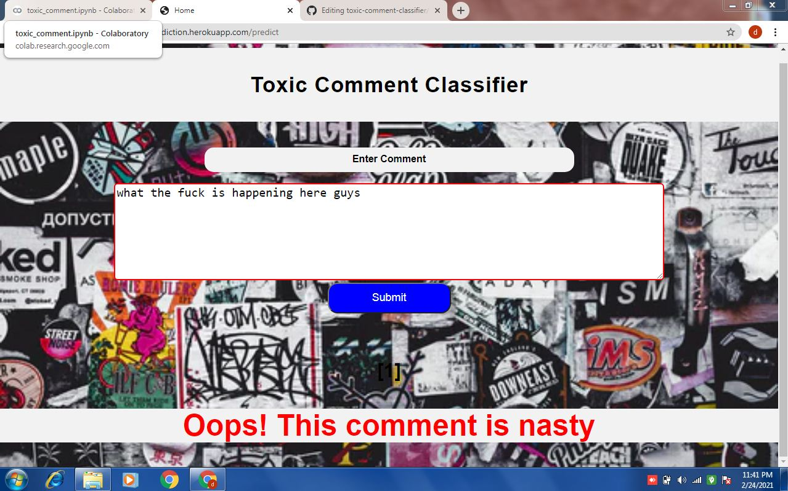
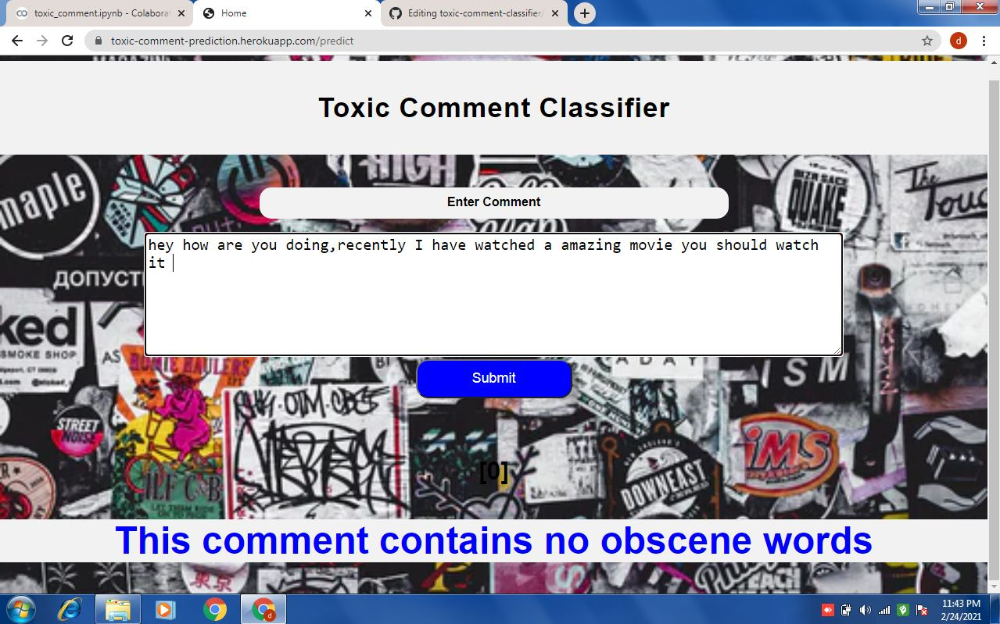

# toxic-comment-classifier

# Heroku
Deployed it to the heroku.Here is the link for application: https://toxic-comment-prediction.herokuapp.com/ 
Here it looks like this 

 

# Overview
This is a flask app which helps us to classify comment

# Motivation
To improve the online conversation. The threat of abuse and harassment online means that many people stop expressing themselves and give up on seeking different opinions. Platforms struggle to effectively facilitate conversations, leading many communities to limit or completely shut down user comments.This model help us to detect the toxic comments

# DataSource
I have taken the dataset from kaggle.Link to the Dataset : https://www.kaggle.com/ericmclachlan/jigsaw-toxic-comment-train-and-test

# Brief
I have done a Exploratory Data Analysis and for used SMOTE Technique to balance the dataset.For more info you can check out the notebook

# Model Summary
So basically I have trained it on 3 three different models
- Logistic Regression
- Naive Bayes
- XgbClassifier

